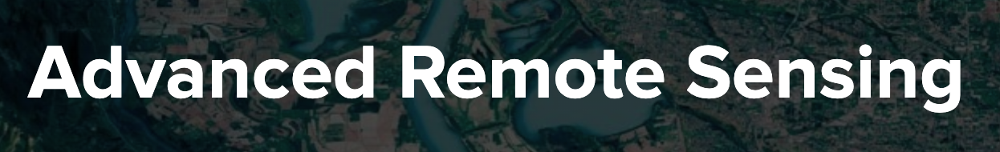

# Advanced Remote Sensing

<figure>
    
    <figcaption>
        
        ## Percepcion remota avanzada
        
    </figcaption>

</figure>

## An university course website created using Quarto.

### 💡 This website is based on a template found [here](https://github.com/jonjoncardoso/quarto-template-for-university-courses).

<strong>On GitHub:</strong>

### 🧰 Dev Setup

### 📟 Contact

**✋ Questions? Suggestions?** If you are not sure how to do something with the template or have a suggestion for a new feature, start a [discussion](https://github.com/jonjoncardoso/quarto-template-for-university-courses/discussions).

**🐞 Spotted any bugs?** Create a new [Issue](https://github.com/jonjoncardoso/quarto-template-for-university-courses/issues).

